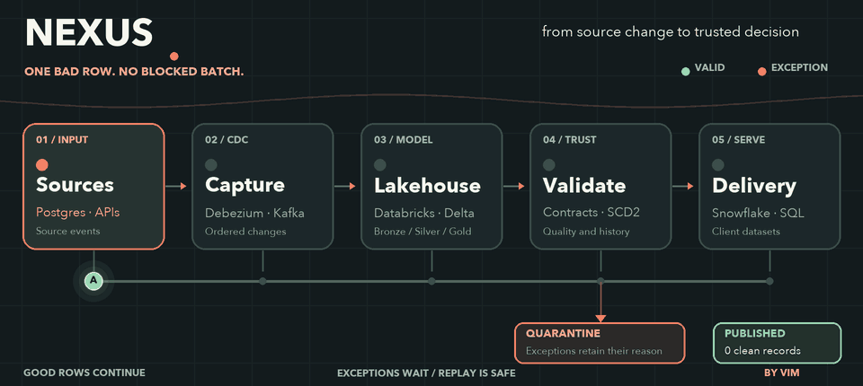
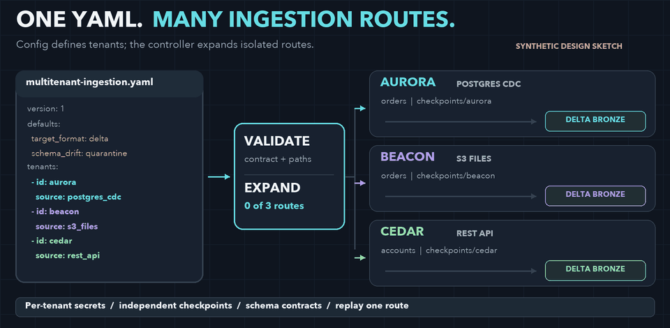
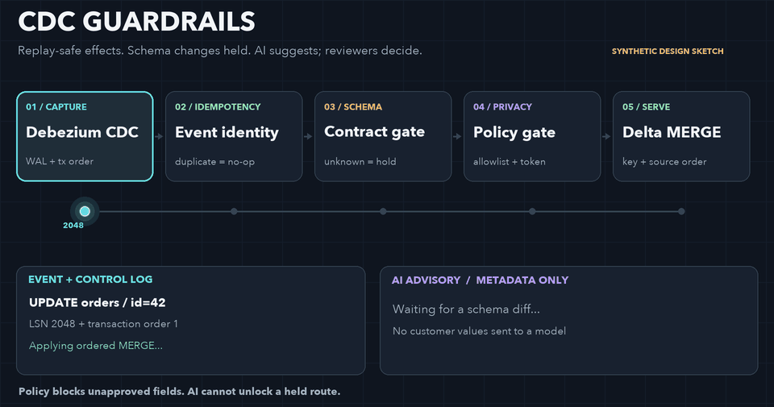
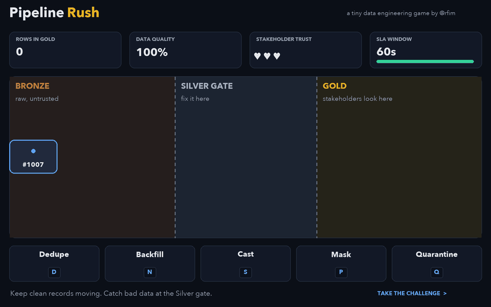

### hi, i'm vim 👋

**Senior Data Engineer** in London. 10+ years building data platforms across insurance, fintech and enterprise, from Deloitte consulting to insurtech scale-ups.

I design platforms that stay trustworthy as they grow: contract-governed pipelines, medallion lakehouses, CDC and streaming ingestion, and the CI/CD and quality checks that keep them honest. Lately I've been pairing that with AI: agentic ops, self-healing pipelines, and LLM interfaces over governed data.

📍 London, UK · 🎓 MSc Computer Science (UVSQ, France) · 🧑‍🏫 Data Engineering instructor at HACKTIV8 since 2019

### NEXUS — data in motion

Three synthetic records show how valid updates keep moving while an exception waits for repair and safe replay. [Explore the interactive architecture and working code](https://rfim.github.io/nexus-73strings/).

### One YAML, many ingestion routes

One config can define each tenant's source, contract, secret reference, checkpoint, Bronze destination and quarantine path. A controller validates it, then runs each tenant and dataset route independently so one tenant can be replayed without resetting the others. [Inspect the example YAML](https://github.com/rfim/rfim/blob/main/examples/multitenant-ingestion.yaml). This is a synthetic architecture sketch.

#### CDC guardrails

In this reference design, the Postgres route handles duplicate and older events, holds schema changes for review, and keeps unapproved fields out of the curated path. An AI advisory hook receives only a schema diff; the runnable demo uses a mock suggestion, and a reviewer decides whether to change the contract. Privacy controls are explicit rules, with the wider GDPR assessment owned by the organisation.

[Inspect the CDC design and runnable reference](https://github.com/rfim/rfim/blob/main/examples/CDC_GUARDRAILS.md).

🎮 **Pipeline Rush**: a 60-second game where you fix bad records between bronze and gold before the SLA runs out.

---

### 🧰 Toolkit

**Platforms** 
    

**Processing** 
   

**Streaming & CDC** 
  

**Orchestration & ops** 
    

**Quality & governance** 
   

**Modelling** 
  

---

### 🎓 Teaching

- **Kelas Semanggi**: open source data engineering curriculum I maintain
- **HACKTIV8**: teaching Databricks, Spark, dbt and dimensional modelling to career switchers since 2019

### ✍️ Writing

Notes on data platforms and engineering on [Medium](https://medium.com/@rfim).

---

### 📫 Get in touch

[LinkedIn](https://www.linkedin.com/in/firmaninsan/) · [Medium](https://medium.com/@rfim)

Open to senior and lead data engineering roles in London and remote UK.
